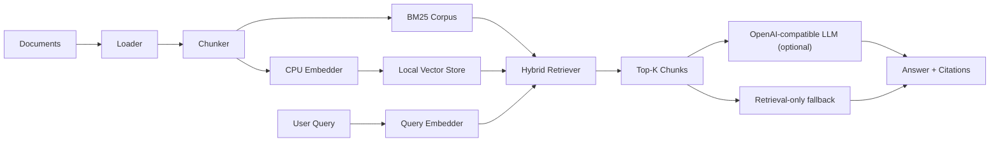

# Modern RAG on CPU

A polished retrieval-augmented generation (RAG) project built for CPU-first deployment. This repository demonstrates an end-to-end solution with local document indexing, hybrid retrieval, a FastAPI backend, browser-based upload/search, and optional OpenAI-compatible generation.

## What this project does

- Ingests local documents from `.txt`, `.md`, `.pdf`, and `.json`
- Splits content into chunks and embeds text using `sentence-transformers` on CPU
- Builds a hybrid retrieval pipeline combining dense vector search and BM25
- Stores index data locally for offline-friendly execution
- Serves a REST API and web UI for ingestion, search, ask, upload, and evaluation
- Skips malformed files during ingestion and reports file-level failures
- Supports optional generation via OpenAI-compatible endpoints or Ollama
- Falls back to retrieval-only answers when no LLM endpoint is configured

## Why this is portfolio-ready

This implementation is designed for practical engineering interviews:

- It balances accuracy and cost by using CPU-friendly embeddings
- It supports grounded answers with citations, not just a generative chatbot
- It includes both API and CLI interfaces for flexible use
- It measures retrieval quality with a small benchmark evaluation dataset
- It is structured so the system works even without an external LLM

## Key features

- Document upload and local ingestion
- Hybrid retrieval with dense search + BM25 ranking
- Grounded Q&A with citation metadata
- Retrieval-only fallback behavior
- Local disk persistence (`.npy` vectors + JSON metadata)
- FastAPI endpoints and simple web UI
- CLI workflow for ingest/search/ask/eval

## Architecture overview



## Repository structure

```text
.
|-- demo_data
|-- knowledge
|-- src/modern_rag
|   |-- api.py
|   |-- cli.py
|   |-- chunking.py
|   |-- embeddings.py
|   |-- evaluation.py
|   |-- llm.py
|   |-- pipeline.py
|   |-- retrieval.py
|   |-- store.py
|   `-- web
|       |-- app.js
|       |-- index.html
|       `-- styles.css
|-- tests
|-- .env.example
|-- pyproject.toml
`-- README.md
```

## Setup

### Requirements

- Python 3.11+
- Windows or Linux
- Local Python environment with dependencies installed from `pyproject.toml`

### Install

```powershell
py -3.11 -m venv .venv
.venv\Scripts\Activate.ps1
python -m pip install --upgrade pip
pip install -e .[dev]
```

### Configure environment

Copy the example environment file and configure your LLM endpoint:

```powershell
Copy-Item .env.example .env
```

Use one of these options:

- **OpenAI-compatible hosted endpoint**
- **Ollama local CPU endpoint**

Example Ollama settings:

```env
OPENAI_BASE_URL=http://localhost:11434/v1
OPENAI_API_KEY=ollama
OPENAI_MODEL=llama3.2:3b
```

If no LLM endpoint is configured, the app still returns retrieval-only responses with relevant source citations.

## Quick start

### Ingest demo data

```powershell
modern-rag ingest --source demo_data
modern-rag eval demo_data\eval.json
modern-rag serve
```

Open the UI at [http://127.0.0.1:8000](http://127.0.0.1:8000).

### Use your own documents

1. Add files to `knowledge/`
2. Run `modern-rag ingest`
3. Run `modern-rag serve`
4. Open the UI and ask questions

## CLI commands

- `modern-rag ingest` - build the local index
- `modern-rag search "<query>"` - retrieve relevant chunks
- `modern-rag ask "<query>"` - ask an end-to-end question
- `modern-rag eval <dataset.json>` - evaluate retrieval quality
- `modern-rag serve` - run the web API and UI

## API endpoints

- `GET /` - web UI
- `GET /health` - health and readiness checks
- `GET /sources` - indexed source summary
- `POST /upload` - upload documents to `knowledge/`
- `POST /ingest` - rebuild the local index
- `POST /search` - retrieve relevant chunks only
- `POST /ask` - answer questions with citations
- `POST /eval` - evaluate retrieval on a JSON dataset

## Evaluation format

Evaluation cases are defined as an array of JSON objects:

```json
[
  {
    "question": "What is hybrid retrieval?",
    "expected_sources": ["demo_data/rag_overview.md"]
  }
]
```

This project reports hit rate at `k` and `MRR@k` to measure retrieval effectiveness.

## Interview-ready summary

This project demonstrates:

- end-to-end ML application design
- CPU-first model selection and local inference
- hybrid retrieval architecture combining dense and sparse signals
- practical API and web UI integration
- robustness through retrieval-only fallback behavior

## Suggested resume bullets

- Built a CPU-first retrieval-augmented generation system using FastAPI, sentence-transformers, BM25, and locally persisted vector indices.
- Implemented hybrid retrieval and grounded question answering with citation-aware results and CLI/API support.

## Next improvements

- Add a post-retrieval reranker
- Support metadata filters and document categories
- Add conversational context tracking
- Expand document parsing to DOCX/HTML
- Swap local storage for a vector database on larger corpora

## Tests

```powershell
pytest
```
